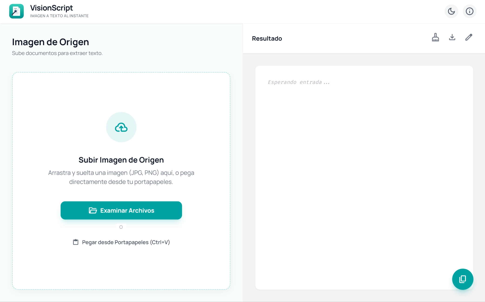

# VisionScript

Imagen a texto en un instante

<div align="center">
  
</div>

<div align="center">
  
  
  
</div>

## Acerca del Proyecto

VisionScript proporciona una solucion de reconocimiento de texto e interpretacion de imagenes desde la web. Permite a los usuarios extraer de forma eficiente caracteres, fragmentos de codigo o contenido general directamente de archivos fotograficos o capturas de pantalla, agilizando la transferencia de datos fisicos al medio digital.

## Características Principales

* **Reconocimiento OCR:** Extracción precisa de texto desde imágenes.
* **Detección de Código:** Ideal para capturar fragmentos de programación.
* **Múltiples Formatos:** Soporte para PNG, JPG y capturas de pantalla.
* **Procesamiento en Navegador:** Utiliza Tesseract.js para un análisis rápido y privado.

## Captura de Pantalla



## Tecnologías Utilizadas

* [HTML5](https://developer.mozilla.org/es/docs/Web/HTML)
* [CSS3](https://developer.mozilla.org/es/docs/Web/CSS) - Tailwind CSS
* [JavaScript](https://developer.mozilla.org/es/docs/Web/JavaScript) - ES6+
* [Tesseract.js](https://tesseract.projectnaptha.com/) - Motor de OCR

## Demo en Vivo

Puedes ver la aplicación funcionando aquí: [[[Enlace a Vercel](https://vision-script-zeta.vercel.app/)]]

## Estructura del Proyecto

```text
VisionScript/
├── assets/
│   ├── icons/
│   │   └── logo.ico
│   └── images/
│       └── logo.png
├── css/
│   └── styles.css
├── js/
│   ├── main.js
│   └── tailwind-config.js
├── index.html
└── README.md
```

## Instalación

1. Clona el repositorio:
   ```bash
   git clone https://github.com/ricard020/visionscript.git
   ```
2. Abre el archivo `index.html` en tu navegador favorito.

## Autor

- **Ricardo** - [GitHub](https://github.com/ricard020)

## Licencia

Este proyecto se encuentra bajo la Licencia MIT.
